# C4 Container Diagram (L2) — BTC Tap Trading System

## Container View

```mermaid
C4Container
    title Container Diagram for BTC Tap Trading System

    Person(trader, "Trader", "Web3 wallet user placing directional bets")
    Person(admin, "Admin", "System operator monitoring health")

    System_Boundary(singleVM, "Single VM (4c/8GB/256GB)") {
        Container(nginx, "Nginx", "Nginx", "Reverse proxy, static file serving, TLS termination, rate limiting")
        
        Container(spa, "Frontend SPA", "React/Vue", "Grid-based betting interface, Web3 wallet integration")
        
        Container(api, "API Server", "Go + Echo/Fiber", "REST API for auth, bet placement, balances, history")
        Container(batcher, "Bet Batcher", "Go", "Channel-based batch writer with conditional SQL deduction + ledger write")
        Container(validator, "Signature Validator", "Go", "Web3 signature validation, replay protection")
        Container(cb, "Circuit Breaker", "Go", "Suspends betting on stale price feed")
        
        Container(ws, "WebSocket Server", "Go", "Real-time price streaming, bet confirmations")
        Container(wsAuth, "Session Manager", "Go", "Web3 session management")
        
        Container(priceIngest, "Price Ingestion", "Go", "External price feed consumer")
        Container(healthMon, "Price Health Monitor", "Go", "Tracks price freshness, triggers circuit breaker")
        Container(resolver, "Bet Resolver", "Go", "Background worker for bet resolution")
        Container(archiver, "Weekly Archiver", "Go + bash", "Automated S3 archival of old bets")
        
        ContainerDb(sqliteRW, "SQLite (Current Week)", "SQLite 3 (WAL mode)", "Bets + transaction_ledger, read-write")
        ContainerDb(sqliteRO, "SQLite (Historical)", "SQLite 3 (Read-Only)", "Previous 4 weeks bets + ledger, read replica")
        ContainerDb(redis, "Redis", "Redis 7", "Sessions, nonces, price cache, pub/sub, rate limiting")
    }
    
    System_Ext(priceFeed, "Crypto Price Feed", "Binance/Coinbase WebSocket API")
    System_Ext(s3, "S3 Cold Storage", "AWS S3 STANDARD_IA for archived bet history")

    %% User interactions
    Rel(trader, nginx, "Accesses web app", "HTTPS")
    Rel(admin, nginx, "Monitors system", "HTTPS")
    
    Rel(nginx, spa, "Serves static files", "HTTP")
    Rel(nginx, api, "Routes API requests", "HTTP :8080")
    Rel(nginx, ws, "Routes WebSocket", "WebSocket :8081")
    
    %% Frontend interactions
    Rel(spa, api, "Places bets via", "HTTPS/JSON")
    Rel(spa, ws, "Receives real-time updates via", "WebSocket")
    
    %% API flow
    Rel(api, validator, "Validates signatures via", "function call")
    Rel(api, cb, "Checks health status via", "function call")
    Rel(api, batcher, "Submits bets to", "channel")
    Rel(api, redis, "Checks sessions, nonces, balances", "Redis Protocol")
    
    Rel(validator, redis, "Checks nonce uniqueness", "SET NX")
    Rel(cb, healthMon, "Monitors", "function call")
    
    Rel(batcher, sqliteRW, "Conditional UPDATE + INSERT", "SQL/sqlite3")
    
    %% WebSocket flow
    Rel(ws, wsAuth, "Authenticates via", "function call")
    Rel(wsAuth, redis, "Validates sessions", "Redis Protocol")
    Rel(ws, redis, "Subscribes to price pub/sub", "Redis Pub/Sub")
    
    %% Price ingestion flow
    Rel(priceIngest, priceFeed, "Streams prices from", "WebSocket")
    Rel(priceIngest, redis, "Publishes prices to", "Redis Pub/Sub")
    Rel(priceIngest, healthMon, "Updates health status", "function call")
    
    %% Resolution flow
    Rel(resolver, redis, "Queries price history from", "Redis Protocol")
    Rel(resolver, sqliteRW, "Resolves bets via", "SQL/sqlite3")
    Rel(resolver, sqliteRO, "Queries historical data from", "SQL/sqlite3 (read-only)")
    
    %% Archival flow
    Rel(archiver, sqliteRW, "Exports old data from", "SQL/sqlite3")
    Rel(archiver, s3, "Uploads compressed archives to", "HTTPS/S3 API")
    Rel(archiver, sqliteRO, "Attaches as read replica", "SQL ATTACH")

    UpdateElementStyle(trader, $fontColor="#fff", $bgColor="#08427b")
    UpdateElementStyle(admin, $fontColor="#fff", $bgColor="#08427b")
    UpdateElementStyle(spa, $bgColor="#438dd5", $fontColor="#fff")
    UpdateElementStyle(api, $bgColor="#438dd5", $fontColor="#fff")
    UpdateElementStyle(ws, $bgColor="#438dd5", $fontColor="#fff")
    UpdateElementStyle(sqliteRW, $bgColor="#438dd5", $fontColor="#fff")
    UpdateElementStyle(sqliteRO, $bgColor="#438dd5", $fontColor="#fff")
    UpdateElementStyle(redis, $bgColor="#438dd5", $fontColor="#fff")
```

---

## Container Descriptions

| Container | Technology | Responsibility |
|-----------|------------|----------------|
| **Frontend SPA** | React or Vue | Grid-based betting UI, Web3 wallet integration, real-time price display |
| **Nginx** | Nginx | Static file serving, reverse proxy, TLS termination, rate limiting, connection limits |
| **API Server** | Go (Echo/Fiber) | REST API for authentication, bet placement, user balances, bet history queries |
| **Bet Batcher** | Go (channel-based) | Buffers bets, conditional SQL deduction, writes to transaction_ledger, flushes in batches |
| **Signature Validator** | Go | Validates EIP-191 Web3 signatures, checks timestamp freshness and nonce uniqueness |
| **Circuit Breaker** | Go middleware | Monitors price feed health, suspends betting when stale (>10s) |
| **WebSocket Server** | Go | Real-time price streaming to clients, bet confirmation events, system status broadcasts |
| **Session Manager** | Go | Web3 session validation and management |
| **Price Ingestion** | Go | Connects to external price feed, normalizes and publishes to Redis |
| **Price Health Monitor** | Go | Tracks price freshness, updates circuit breaker status |
| **Bet Resolver** | Go | Background worker scanning expired bets, resolving wins/losses using price history |
| **Weekly Archiver** | Go + bash | Exports old bet partitions, compresses with zstd, uploads to S3 |
| **SQLite (Current Week)** | SQLite 3 (WAL mode) | Active week: `bets`, `transaction_ledger`, `users` tables (read-write), ~18GB |
| **SQLite (Historical)** | SQLite 3 (read-only) | Previous 4 weeks (bets + ledger), attached read replica, ~72GB |
| **Redis** | Redis 7 | Sessions (24h TTL), nonce tracking (90s TTL), price cache (1h), price history (7d), pub/sub, rate limiting |

---

## Key Relationships

| Source | Destination | Description | Protocol/Mechanism |
|--------|-------------|-------------|-------------------|
| Trader → Nginx | | Accesses web application | HTTPS |
| Nginx → SPA | | Serves static assets | HTTP |
| Nginx → API Server | | Routes API requests | HTTP :8080 |
| Nginx → WebSocket Server | | Routes WebSocket connections | WebSocket :8081 |
| Frontend SPA → API Server | | Places bets | HTTPS/JSON |
| Frontend SPA → WebSocket Server | | Receives real-time updates | WebSocket |
| API Server → Signature Validator | | Validates Web3 signatures | Function call |
| API Server → Circuit Breaker | | Checks price health status | Function call |
| API Server → Bet Batcher | | Submits bets for batching | Go channel |
| API Server → Redis | | Session, nonce, balance checks | Redis Protocol |
| Bet Batcher → SQLite (Current) | | UPDATE balance + INSERT ledger + INSERT bet | SQL/sqlite3 |
| WebSocket Server → Redis | | Subscribes to price pub/sub | Redis Pub/Sub |
| Price Ingestion → Price Feed | | Streams real-time prices | WebSocket |
| Price Ingestion → Redis | | Publishes normalized prices | Redis Pub/Sub |
| Bet Resolver → SQLite (Current) | | Resolves pending bets | SQL/sqlite3 |
| Bet Resolver → SQLite (Historical) | | Queries historical bet data | SQL (read-only) |
| Weekly Archiver → S3 | | Uploads compressed archives | HTTPS/S3 API |

---

## Hardening Measures

### 1. Write Batching (ADR-005)
- **Before:** 3,000 individual SQLite transactions/sec → contention
- **After:** 30 batched transactions/sec (100 items or 100ms)
- **Impact:** Sustainable 3K RPS with <50ms latency

### 2. Time-Based Partitioning (ADR-006)
- Current week: `bets_yyyy_ww.db` (read-write, ~10GB)
- Historical: 4 weeks attached read-only (~40GB)
- Archived: zstd compressed to S3 STANDARD_IA (infinite retention)

### 3. Replay Protection (ADR-007)
- Timestamp freshness: 30-second window
- Nonce uniqueness: Redis SET NX with 90s TTL (was 24h, optimized in v1.2)
- Chain ID binding: Prevents cross-chain replay

### 4. Stale Price Circuit Breaker (ADR-008)
- Health threshold: 3s = DEGRADED, 10s = CRITICAL
- CRITICAL state: All bet placement rejected with 503
- Recovery: Only after 30s of stable updates (hysteresis, v1.2)

### 5. Read Replica for Resolution
- Bet Resolver uses read-only connection for historical queries
- Eliminates read-write contention during resolution
- Covering index on `(target_time, min_price, max_price)`

### 6. Conditional Balance Deduction (ADR-009) — v1.2
- **Problem:** Redis balance check + SQLite batch deduction = double-spend race
- **Solution:** Database as single source of truth
- **Implementation:** `UPDATE users SET balance = balance - ? WHERE id = ? AND balance >= ?`
- **Impact:** RowsAffected = 0 means insufficient funds, even if Redis cache said otherwise

### 7. Optimized Nonce TTL — v1.2
- **Before:** 24h TTL = ~260M keys = ~13GB RAM at 3K RPS
- **After:** 90s TTL (30s window + 60s buffer) = ~270K keys = ~13MB RAM
- **Impact:** 1000× memory reduction

### 8. Circuit Breaker Hysteresis — v1.2
- **Enter CRITICAL:** Immediate at >10s stale
- **Recover to HEALTHY:** Only after 30s of stable updates
- **Impact:** Prevents flapping on unstable feed

### 9. UX Strictness — v1.2
- **Pending state:** Pulsing animation until WebSocket confirmation
- **Confirmed state:** Solid color after `bet:confirmed` event
- **Unknown state:** Error if disconnect during pending
- **Impact:** Prevents phantom bet perception

### 10. Hybrid Transaction Ledger (ADR-010) — v1.3
- **Problem:** Mutable balance has no audit trail; disputes unanswerable
- **Solution:** Append-only `transaction_ledger` table written in same transaction
- **Implementation:** 
  - `UPDATE users` (deduct)
  - `INSERT INTO transaction_ledger` (audit: amount, balance_after, ref_type, ref_id)
  - `INSERT INTO bets` (record)
- **Impact:** Complete paper trail; can rebuild balance from ledger
- **Performance:** +1 INSERT per bet (negligible with batching)
- **Storage:** ~75% increase (200B → 350B per bet), manageable with archival
