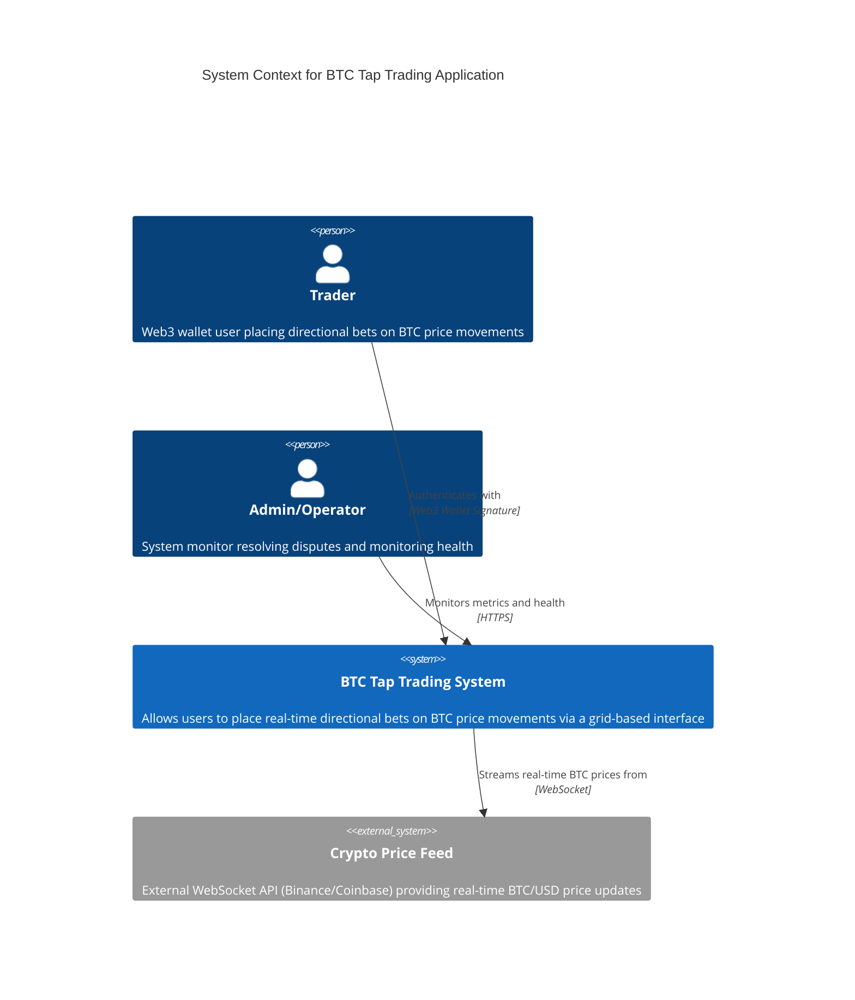

# C4 Context Diagram (L1) — BTC Tap Trading System

## System Context

### Diagram Description

| Element | Type | Description |
|---------|------|-------------|
| **Trader** | Person | End-user with Web3 wallet placing directional bets on BTC price movements via grid interface |
| **Admin/Operator** | Person | Internal team member monitoring system health, resolving disputes |
| **BTC Tap Trading System** | System | The complete betting application including API, WebSocket, background workers, and data stores |
| **Crypto Price Feed** | External System | Third-party WebSocket API providing real-time BTC/USD price updates |

### Relationships

| Source | Target | Description | Protocol |
|--------|--------|-------------|----------|
| Trader | BTC Tap Trading System | Places bets via Web UI | HTTPS / WebSocket |
| Trader | BTC Tap Trading System | Authenticates with Web3 wallet | Web3 Signature |
| Admin | BTC Tap Trading System | Monitors metrics and system health | HTTPS |
| BTC Tap Trading System | Crypto Price Feed | Subscribes to real-time price stream | WebSocket |
